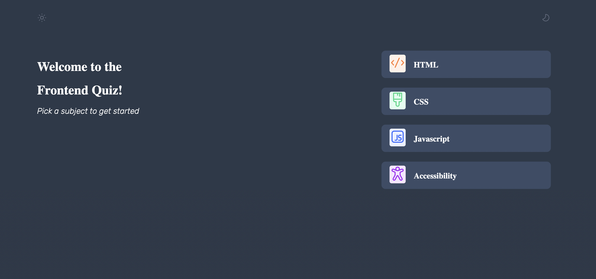
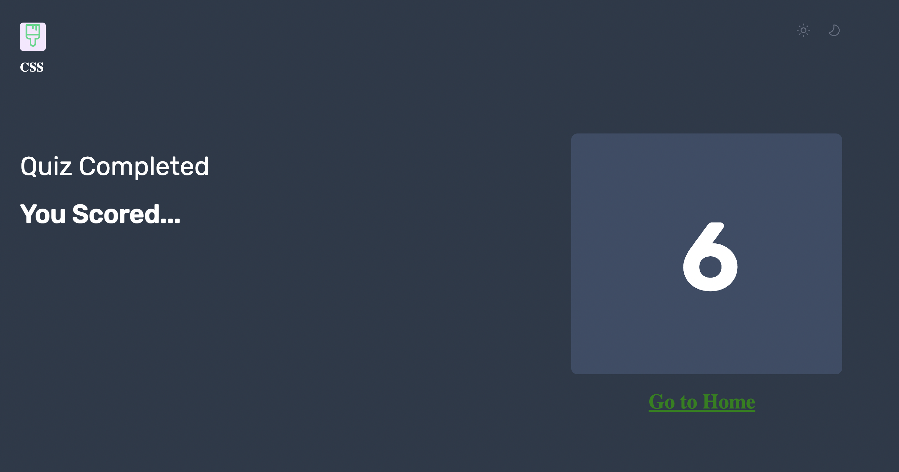

# Quiz App


This is a Django-based quiz application that allows users to take quizzes on various topics, provides instant feedback for each question, and displays a final score summary.

## Features

- **Home Page Template**:
  - Displays a list of available quiz topics.
  - Each topic is a link that directs users to the corresponding quiz.

- **Question Template**:
  - Shows individual questions one at a time.
  - Allows users to select answers and move to the next question.
  - Provides feedback on answer correctness.

- **Score Template**:
  - Displays the user's final score.
  - Provides feedback on correct and incorrect answers.
  - Option to retake the quiz or go back to the home page.

## Screenshots

1. Home Page Template
  

2. Question Template
   

3. Score Template
  

## How to Use

1. Clone the repository to your local machine.
2. Install the required dependencies using `pip install -r requirements.txt`.
3. Run the Django development server using `python manage.py runserver`.
4. Access the app in your web browser at `http://localhost:8000/`.

## Technologies Used

- Frontend: HTML, CSS, JavaScript
- Backend: Python (Django)
- Database: SQLite (default database in Django)

## Getting Started

1. Clone the repository:
   ```sh
   git clone https://github.com/dubemmmm/QuizApp.git

